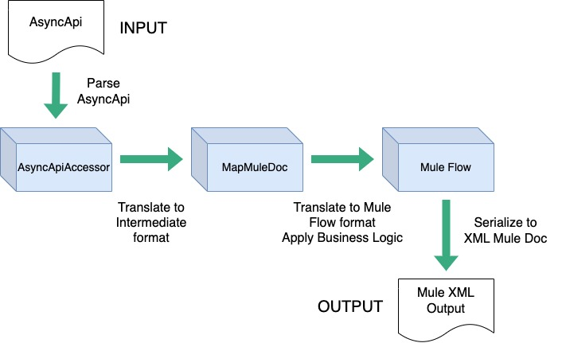

# Solace Event Portal to Mule Flow Generator

## Design

### Process Description

The MuleFlow Generator uses a two-step translation process:
1. **Convert the source format into an internal format.**
    - This is a direct mapping of elements into the internal, *intermediate* format. Little knowledge of the final format is required.
2. **Convert the intermediate format into the Mule Flow XML.**
    - In this step, most of the business logic is applied. Logic such as flow names, references, etc. are created.

### Data Models

* AsyncApiAccessor - Uses GSON to parse AsyncApi input document. AsyncApiAccessor provides convenience methods for extracting data elements.
* MapMuleDoc - A simple internal format to facilitate mapping from sources and to insulate source mapping from the business logic required to produce Mule Flow documents
* MuleDoc - A model created for the XML representation of Mule Flows. Unlike the actual mule flow docs used by studio (which uses jaxb), the mapper uses Faster Jackson parsers to serialize the XML data.

# Build

## Build for local use
`mvn clean package`

## Build for use as Lib
`mvn clean install`

# Implement

The mapper procedure can be called statically using one of four methods in `com.solace.ep.muleflow.MuleFlowGenerator` class. Each of the four methods map AsyncApi to Mule Flow XML the same way. The distinctions are the inputs (AsyncApi File Path or String) and outputs (XML to File or return as String)

|**AsyncAPI &darr;**|**Return XML as String**|**Output XML to File**|
|---|---|---|
|**Input String**|`getMuleDocXmlFromAsyncApiString`|`writeMuleXmlFileFromAsyncApiString`|
|**Input File Path**|`getMuleDocXmlFromAsyncApiFile`|`writeMuleXmlFileFromAsyncApiFile`|

# Project TO-DO

- Change static maven `pom.xml` to be generated dynamically
    - Add file comments indicating that the project was generated by Solace tooling
- Refactor source as module in project; Add CLI utility as separate module
- Solution for circular flow-ref in business logic flows
    - There isn't a great solution for how to handle this. Possibly could create a "logger" sub-flow and link all Business logic subflows to it. To prevent accidental infitite loop, which can be annoying even in dev. Would need instructions to customer for how to handle this.
- Update README instructions for how to install and integrate the project

## Completed

- &#9989; Add ability to identify and write schema files in resources directory
    - Collect schemas from `components.schemas`
    - Collect schemas `components.messages` (Not handled as `$ref` elts) Currently out of EP:
        - json schemas are handled in the `schemas` blocks
        - avro schemas are handled in-line in `messages` block
    - Ensure schema files (by content) are written exactly once to the resources directory
    - Schema files should be appropriately named; there will be difference between avro/json; json schema name can be null
        - Establish order of precedence for names
    - Update ingress and egress flows to point to the correct schema files under `resources` folder
- &#9989; Move Solace connector config to `global.xml` file and include in the project, according to Mule best practices
- &#9989; Construct topic string in Dataweave accounting for parameters
