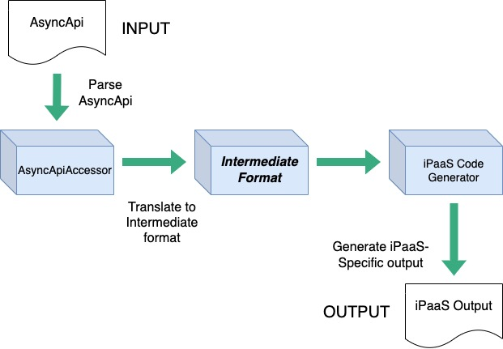

# Code Generator for Solace Event Portal Applications
The Code Generator uses Solace Event Portal applications represented as AsyncApi and uses them to create scaffolded code for use in integration platforms (iPaaS). The purpose is to facilitate development and to provide an integral component in an efficient Development Lifecylce procedure.

**Currently, the Code Generator is capable of:**
- **Mule** - Generating Mule flow projects (jar files) suitable for import into Anypoint Studio
- **SAP IFlow** - Generating SAP IFlow XML documents. The ability to create packaged IFlow projects is delegated to a separate process

## Design

### Process Description

The Code Generator uses a two-step translation process:
1. **Convert the source format into an internal format.**
    - This is a direct mapping of elements into the internal format. Little to no knowledge of the final format is required.
2. **Convert the internal format into the iPaaS-specific output structure**
    - In this step, most of the business logic is applied. Logic such as flow names, references, etc. are created.

### Data Models

* **AsyncApiAccessor** - Uses GSON to parse AsyncApi input document. AsyncApiAccessor provides convenience methods for extracting data elements.
* **MapMuleDoc** - A simple internal format to facilitate mapping from AsyncApi. The internal format insulates source mapping from the business logic required to produce generated code. Generated code can be in distinct formats as required by the target iPaaS.
* **MuleDoc** - A model created for the XML representation of Mule Flows. Unlike the actual mule flow docs used by studio (which uses jaxb), the mapper uses Faster Jackson parsers to serialize the XML data.
* **BPMN2/SAP IFlow** - Imported data format that provides representation for SAP IFlows. The format is XML wireline.

# Build

## Build for local use
`mvn clean package`

## Build for use as Lib
`mvn clean install`

## List out dependencies
`mvn dependency:copy-dependencies -DincludeScope=runtime -DoutputDirectory=./mydeps`

# Implement

## Mule
The Mule mapper is intended to create complete Mule projects from an Eclipse plugin to Anypoint Studio. (need reference)

The mapper procedure can be called statically using convenience methods in `com.solace.ep.codegen.mule.eclipse.EclipseProjectGenerator` class. The resulting output is a packaged `jar` file containing a complete MuleFlow project that can be imported into Eclipse.

**EclipseProjectGenerator:**
- Method: `generateEclipseArchiveForMuleFlowFromAsyncApi`
- Paramters: 
    - `groupId` - Maven Group ID of the new Mule Project
    - `flowNameArtifactId` - Artifact ID
    - `version` - Version
    - `asyncApiAsString` - AsyncApi string
    - `projectOutputPathAsString` - Target path of the generated project
    - `cloudHubProject` - (boolean, optional) Include CloudHub configuration

## SAP IFlow
SAP IFlow generator creastes the IFlow BPMN2/XML document from an AsyncApi. Convenience methods are provided in class `com.solace.ep.codegen.sap.iflow.SapIFlowGenerator`.

|Method|Input|Output|
|---|---|---|
|writeSapIflowFileFromAsyncApiFile|AsyncApi File Path|IFlow File|
|writeSapIflowFileFromAsyncApiString|AsyncApi String|IFlow File|
|writeSapIflowFileFromMapDoc|MapMuleDoc Object|IFlow File|
|getSapIflowFromAsyncApiString|AsyncApi String|Return IFlow XML String|
|getSapIflowFromAsyncApiFile|AsyncApi File Path|Return IFlow XML String|
|getSapIflowFromMapDoc|MapMuleDoc Object|Return IFlow XML String|

# Project TO-DO

- Change static maven `pom.xml` to be generated dynamically
    - Add file comments indicating that the project was generated by Solace tooling
- Solution for circular flow-ref in business logic flows
    - There isn't a great solution for how to handle this. Possibly could create a "logger" sub-flow and link all Business logic subflows to it. To prevent accidental infitite loop, which can be annoying even in dev. Would need instructions to customer for how to handle this.
- Update README instructions for how to install and integrate the project

## Completed

- &#9989; Add ability to identify and write schema files in resources directory
    - Collect schemas from `components.schemas`
    - Collect schemas `components.messages` (Not handled as `$ref` elts) Currently out of EP:
        - json schemas are handled in the `schemas` blocks
        - avro schemas are handled in-line in `messages` block
    - Ensure schema files (by content) are written exactly once to the resources directory
    - Schema files should be appropriately named; there will be difference between avro/json; json schema name can be null
        - Establish order of precedence for names
    - Update ingress and egress flows to point to the correct schema files under `resources` folder
- &#9989; Move Solace connector config to `global.xml` file and include in the project, according to Mule best practices
- &#9989; Construct topic string in Dataweave accounting for parameters
